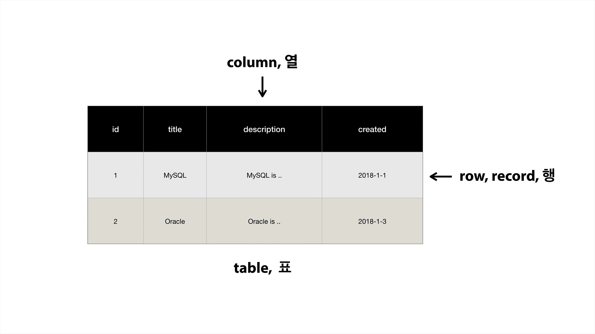

# 생활 코딩 DATABASE2 MySQL
>**Data base** : 컴퓨터 언어로 글을 써서 사용 가능하며 php와 같은 언어와 결합하여 웹페이지 활용 가능

>**Spread sheet** : 클릭을 통하여 사용가능

---

### 1. MySQL의 구조

* 데이터베이스 구성 database server/schema/table

---

### 2. Database server 접속
 보안
* 데이터베이스는 자체적인 보안 체계를 가지고 있어 안전하게 데이터를 보관 가능

+ 권한 기능이 있어, 여러 사용자(user)를 등록하거나 제한할 수 있음.
  
* > mysql -uroot -p

---

### 3. MySQL schema(Database) 사용

* 생성 : CREATE DATABASE schema이름;

* 삭제 : DROP DATABASE schema이름;

* 확인 : show DATABASE;

* 사용 : USE schema이름;

> 단축키 ⏫ : 이전에 사용한 코드 불러오기

---

### 4. SQL과 테이블 구조

* table(행렬)  
  column은 구조
  row는 데이터 자체

---

### 5. MySQL 테이블의 생성
