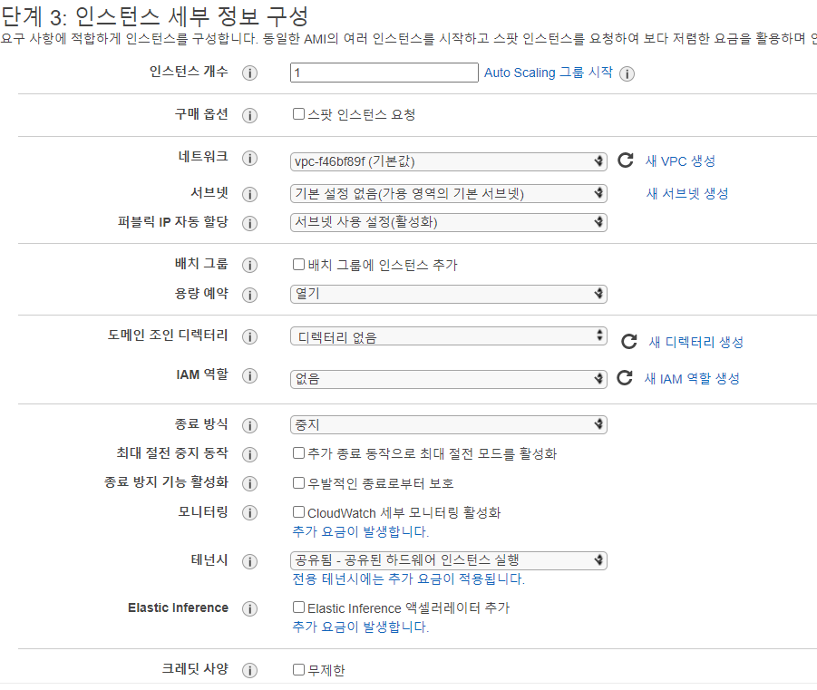

1. 회원가입

2. MFA(Multi-Facter Authentication)
    - 홈 -> IAM -> MFA 활성화 -> 가상 MFA 디바이스 클릭

3. 서버 선택
    - Region
        - 개발자의 위치가 아닌 소비자의 위치 기준으로 잡아야함
         > https://www.cloudping.info/

    - availaility zone
      - 백업의 역할

4. EC2(Elastic Compute Cloud)

---

## 가상머신 생성

 1. 인스턴스(컴퓨터) 생성
     - 타입
         - Memory 우위 M
         - cpu 우위는 C
     - 가격정책 
         - 프리티어
           > 1달에 720/750 시간  

           > 데이터 전송 15GB   

           > EBS(Elastic Block Store) 30GB + I/O 200만건
         
         - 온 디맨드 인스턴스(켜고 끔)

 2. 인스턴스 장치 설정
     - 
         

종료방식
중지 - 스토리지 비용 발생

         종료 - 데이터까지 삭제 

         

모니터링
CPU 점유율, 사용률을 더 자세하게 기록해줌(돈들어감)
  

    - 보안그룹
        - SSH(리눅스) // 느림
        - HTTP(웹배포용)
        - RDP(윈도우)
    
    - key pair
        - create a new key pair -> download key pair

---

## 가상머신 접속

1. 리눅스 기반 인스턴스 접속
    - 윈도우는 SSH가 없으므로 SSH역할하는 프로그램을 깔아야함 원격제어
      

SSH
Secure SHell(CUI, CLI환경 어렵고 보안성 뛰어남)
 
    - Xshell 설치

        > https://www.netsarang.com/ko/free-for-home-school/

    - 열기 -> 새로만들기 연결(이름, 호스트(퍼블릭 IP) 입력) -> 사용자 인증(이름입력(ubuntu), 암호 public key -> 가져오기)
        > exit
    - 업데이트 및 아파치 설치
        - sudo apt-get install apache2 아파치 설치
          > substitute user do(sudo)
        - sudo apt-get update; # 소프트웨어 업데이트

    - 디렉토리 진입
        - cd /var/www
        - ls -al (장소에 무엇이 있는지 확인)
        - cd html(경로)
        - sudo rm index.html (html 삭제)
        - sudo nano index.html

2. 윈도우 기반 인스턴스 접속
    - 

RDP
Remote Desktop Protocol(GUI환경에 쉽고 보안성이 안좋음)

    
    - 보안설정 변경
      RDP 클라이언트 -> 암호가져오기 -> 데스크톱 파일 설치 -> 실행 sever manage -> Local Server(IE Ehance ~~~)
    
    - IIS 설치 
     Sever Manager -> manage -> add roles~~~ (Next 쭉 하다가) -> Sever Roles에서 Web Server IIS체크(Internet Information Server)

    - ISS Manager -> Default Web Site 오른쪽 클릭(Explore) ->

3. public DNS 접속
 
---

## 이미지(백업)

1. ㅇ

    🧨이미지를 만들때는 서버가 잠깐 멈춤 

---
1. EC2 인스턴스에서 ubuntu 버전?

---

## 참고자료
https://jumpcloud.com/blog/rdp-ssh#cookie-accept SSH vs RDP