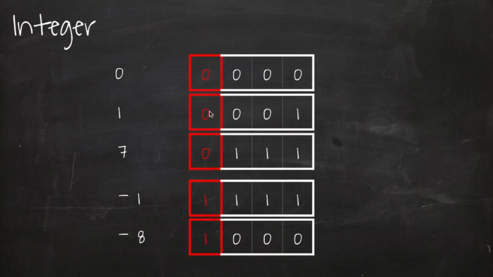

### 1. 비트 연산

---
* 컴퓨터는 0과 1로 정보를 저장한다.

* int형은 4byte = 32bit(1비트는 1칸)이다
  
    > 0~31번째 칸에서 31번 칸은 양, 음 판단

    

 * 연산자  
   OR 연산자 : 0, 1 둘 중 하나라도 1일때 1  
   XOR 연산자 : 0, 1 둘이 다를때 1  
   NOT 연산자 : 0과 1이 반대가 됨  
   Shift 연산자 : 기호의 방향 + 숫자만큼 숫자가 이동함

   >logical right shift(>>>) 부호도 옮김  
   >arithmetic right shift(>>) 부호는 지킴(복사됨) 1010 -> 1111

### 문제

---

getBit num & ((1 << i)) // 해당 index값을 알아내는 방법  

setBit (num | (1 << i)) // 해당 index값을 1로 만드는 방법

clearBit (num & ~(1 << i))  // 해당 index값을 0으로 만드는 방법

clearLeftBit (num & ((1 << i) - 1)) 해당 index값의 왼쪽을 모두 0으로 만듬

clearRightBit (num & (-1 << (i + 1))) 해당 index값의 오른쪽을 모두 0으로 만듬

updateBit(num & ~(1 << i)) | ((val? 1:0)<< i)