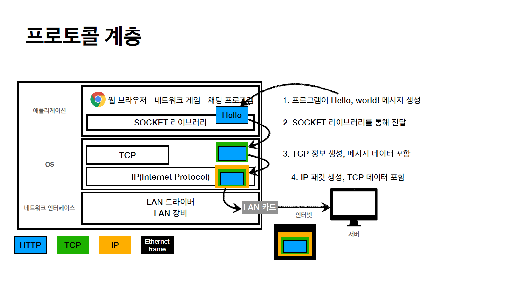

# HTTP

## 1. 인터넷과 네트워크

 1. 인터넷 통신  
   클라이언트 -> 인터넷(복잡) -> 서버

 2. IP  
      - 출발지(클라이언트) IP -> 목적지(서버) IP  
        > 클라이언트 패킷 전달

      - 목적지(서버)IP -> 출발지 IP
        > 서버 패킷 전달  

        ※ 패킷 전달 경로가 다를 수 있음  

 3. 한계  
      - 비연결성
        > 패킷을 받을 대상이 없거나 서비스 불능이여도 패킷 전송(컴퓨터 꺼져있는 경우)

      - 비신뢰성
        > 중간에 패킷이 사라질 경우 (인터넷을 지나다 중간층 서버가 꺼질 경우, 광케이블이 물리적 손실을 입었을 경우 등)

        > 패킷이 순서대로 안오면 ex) hello world -> world hello
   
      - 프로그램 구분
        > 같은 IP를 사용하는 서버에서 통신하는 어플이 2개 일 경우(컴퓨터 멀티태스킹)

    

packet
package + bucket 포장된 블록

---

## 2. TCP / UDP

 - 인터넷 프로토콜 스택의 4계층
      - 애플리케이션 계층 -HTTP, FTP
      - 전송 계층 TCP, UDP
      - 인터넷 계층 IP
      - 네트워크 인터페이스 계층
        
        
 1. 

TCP 특징
전송 제어 프로토콜(Transmission control protocol

  