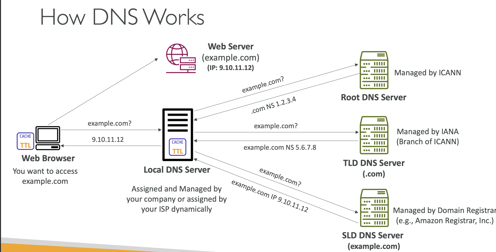

# 웹브라우저에 URL 입력시 일어나는 일

## 기본적인 일

- URL(Uniform Resource Locator)을 입력하였을때, 기본적으로 서버의 IP주소를 알아내야하므로, DNS서버에게 질의해야함
    - 그러나 DNS는 분산형 

1. Hosts 파일을 찾아봄
2. DNS Cache를 확인해봄
3. DNS질의
    - 공유기가 질의하여 넘겨줌
    - PC가 직접 질의

4. IP 주소 획득하여 Sever로 TCP 연결
    > HTTP는 TCP 연결 기반

5. HTTP Request
6. HTTP Response

## 기본적인 일
- 하지만 일반적으로 회사들은 GSLB를 구현하고, CDN을 사용함

- 무중단 배포
    - rolling update 배포
    - blue green 배포 방식