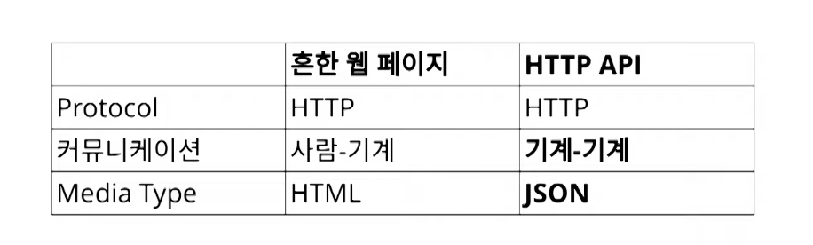
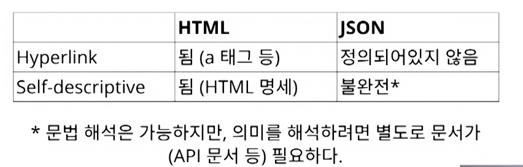

# RESTful API란 무엇인가
> Representational State Transfer

### REST??
- Representational State Transfer
  - REpresentational : 대표
  - State : 상태
  - Transfer : 이전

## 개요
> WEB(HTTP)의 장점을 최대한 살리기 위해 만들었다. (Roy Fielding)

- 최근 백엔드 채용 공고를 보면 REST API라는 말을 많이 보게된다. 그런데 아무리 찾아봐도 어려운 말만 늘어놓고 무슨 말인지 하나도 모르겠어서 공부해서 적어보았다. 서버와 클라이언트가 정보를 주고받는데 REST하게 주고 받는다??? <del>(역시 모르겠다)<del>

## 구성 요소

- 분산 하이퍼미디어 시스템(웹)을 위한 아키텍쳐 스타일
- 아키텍처 스타일 : 제약조건의 집합

구성 요소로 5가지를 만족해야하는데 오늘날의 API는 uniform interface를 잘 지키지 못함

### REST를 구성하는 스타일
- client-server
- stateless
- cache
- **uniform interface**
  - identification of resources : 리소스가 URI로 식별 되는가?
  - manipulation of resources throurgh represntations : representations 전송을 통해 리소스를 조작해야함
  - **self-descriptive messages** : 메시지는 스스로를 설명해야함 <del>**(이게 문제다)**</del>
  - **hypermedia as the engine of application state (HATEOAS)** : 애플리케이션의 상태는 hyperlink를 통해 전이되어야함 <del>**(이게 문제다)**</del>

- layered system
- code-on-demand (optional) : 서버에서 코드를 클라이언트한테 보내서 실행이 가능해야함 (javascript)

### 웹페이지과 비교
- Q : 어떻게 WEB에서 정보를 공유할 것인가?
- A : 정보들을 하이퍼 텍스트로 연결한다.
  - 표현형식 : HTML 
    - Representational
  - 식별자 : URI
    - State
  - 전송 방법 : HTTP
    - Transfer





- 상위에 나온 내용은 웹에서 나온 웹과 REST API를 보면 표현방식(HTML, JSON)이 다르다. 인간은 HTML을 보든 JSON을 보든 의미를 해석하는데에 문제가 없지만 기계는 문제가 생긴다.

#### 웹
```
GET / todos HTTP/1.1
HOST: example.org

HTTP/1.1 200 OK
Content-Type: text/html
<html>
    <body>
        <a href="http://jmsmg.github.io">홈페이지</a>
    </body>
</html>
```

- HTML 태그 실행시
  1. content-type을 컴퓨터가 확인
  2. IANA라는 곳에서 text/ html을 찾음
  3. w3.org에 가서 명세를 해석

#### JSON

```
GET / todos HTTP/1.1
HOST: example.org

HTTP/1.1 200 OK
Content-Type: application/json

{"이름" : "조성곤", "국적" : "한국"}
```

- JSON 실행시
    1. content-type을 컴퓨터가 확인
    2. IANA라는 곳에서 application/ json을 찾음
    3. JSON 파싱은 성공하지만, key값인 이름, 국적이 무슨 뜻인지 컴퓨터는 알 수 없다.

## 정리

- 오늘날 대부분 REST API는 사실 REST를 따르지 않음
- REST 제약 조건 중에서 특히 self-descriptive와 HATEOAS를 잘 만족하지 못함
- REST는 긴 시간에 걸쳐 진화하는 웹 애플리케이션을 위한 것
- REST를 따를 것인지 API 설계하는 이들이 스스로 판단해서 결정해야함
- 따르지 않으면 HTTP API가 맞음

---

링크  
[그런 REST API로 괜찮은가](https://youtu.be/RP_f5dMoHFc)  
[나머지 정리](https://github.com/jmsmg/TIL/blob/main/Network/REST_API.md)