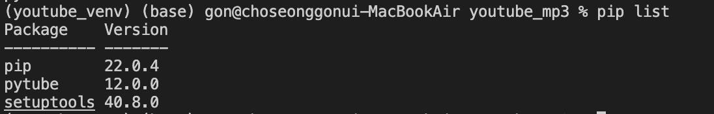
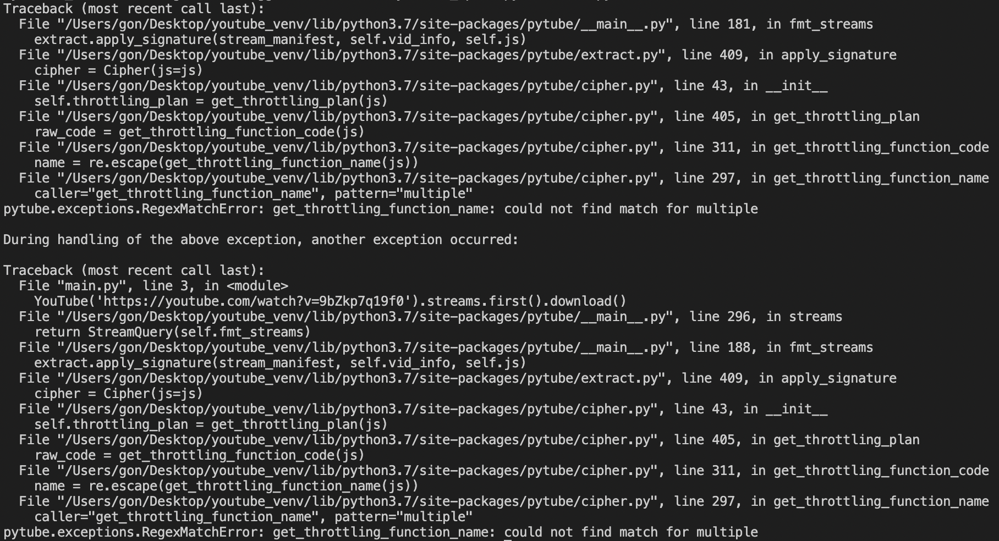
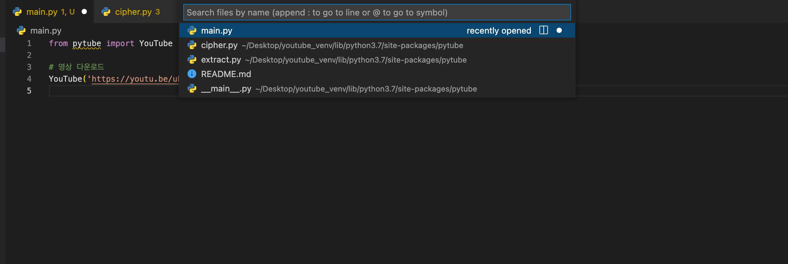
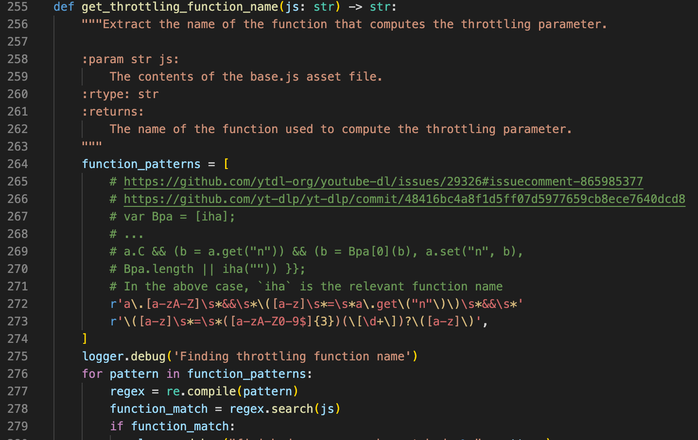

# 파이썬 유튜브 음원 추출 프로그램

- 유튜브 음원이 필요하여 다운 받고 싶었는데, 구글에 유튜브 음원 추출을 찾으면 뭔가 들어가기만 해도 바이러스 걸릴 것 같은 사이트만 수두룩 빽빽하여 파이썬으로 만들어보았다.

## pytube

- 우선 pytube라는 라이브러리 설치를 해야한다. (나는 [가상환경](https://docs.python.org/ko/3/library/venv.html)을 사용하여 진행하였다.)

- 터미널 창에 아래의 문구를 입력한다.

```shell
pip install pytube
```
- pytube 버전


## 라이브러리 테스트 및 수정

- 작성하는 도중 알게 되었는데, pytube 12.0.0 버전의 라이브러리는 정규표현식에 오류가 있어 현재 유튜브에서 사용이 불가능하여 라이브러리 코드를 변경해주어야한다.
- 향후 pytube에서 수정이 될지도 모르니 먼저 테스트로 돌려보고 안될시 변경해주면 된다.

---
- 현재 코드
```python
from pytube import YouTube

# 영상 다운로드
YouTube('https://youtu.be/uBsAV3KJfcU').streams.first().download()

```
---

- 기본적인 코드로 테스트를 진행해보았는데, 아래와 같은 에러가 나왔다.



- 구글링한 결과 라이브러리 안에 cipher.py 내에 get_throttling_function_name
---

## 라이브러리 문제 해결 방법(문제 없이 원하는 파일이 다운로드 될 때는 패스)
  > [참조 링크](https://stackoverflow.com/questions/68945080/pytube-exceptions-regexmatcherror-get-throttling-function-name-could-not-find)

- 유튜브의 함수 패턴이 바뀌어 정규표현식을 수정해주어야 한다.

- VSCode의 경우 Command + p를 누르면 사용중인 파일을 탐색할 수 있다.
)

- cipher.py의 클래스 get_throttling_function_name의 코드를 수정해주어야 한다

- 현재 코드


- 현재 코드 function_patterns를 수정해주면 정상적으로 실행이 된다.

``` python
function_patterns = [
        # https://github.com/ytdl-org/youtube-dl/issues/29326#issuecomment-865985377
        # https://github.com/yt-dlp/yt-dlp/commit/48416bc4a8f1d5ff07d5977659cb8ece7640dcd8
        # var Bpa = [iha];
        # ...
        # a.C && (b = a.get("n")) && (b = Bpa[0](b), a.set("n", b),
        # Bpa.length || iha("")) }};
        # In the above case, `iha` is the relevant function name
        r'a\.[a-zA-Z]\s*&&\s*\([a-z]\s*=\s*a\.get\("n"\)\)\s*&&\s*'
        r'\([a-z]\s*=\s*([a-zA-Z0-9$]{2,3})(\[\d+\])?\([a-z]\)'
    ]
```

## 본격 코드 작성

- 뭐 기본적으로 유튜브 음원만 추출 하는 기능만 필요하다면 사실상 아래의 코드만 집어넣어도 완성이다.

```python
from pytube import YouTube

#유튜브 전용 인스턴스 생성
yt = YouTube('https://youtu.be/uBsAV3KJfcU')

print(yt.streams.filter(only_audio=True).all())

# 특정영상 다운로드
yt.streams.filter(only_audio=True).first().download()

print('추출 완료')
```

- 그런데 나는 여러 영상을 더 원하기 때문에 input() 기능과 무한 루프 기능을 추가하여 마무리 하였다.

```python
from pytube import YouTube

while True:
    url = input('추출할 URL을 입력하세요. ')
    #유튜브 전용 인스턴스 생성
    yt = YouTube(url)

    print(yt.streams.filter(only_audio=True).all())

    # 특정영상 다운로드
    yt.streams.filter(only_audio=True).first().download()

    print('추출 완료')
```

---

- 별도로 라이브러리 깃허브에 [pull request](https://github.com/pytube/pytube/pull/1304) 요청 완료
- [소스 코드](https://github.com/jmsmg/youtube_mp3)