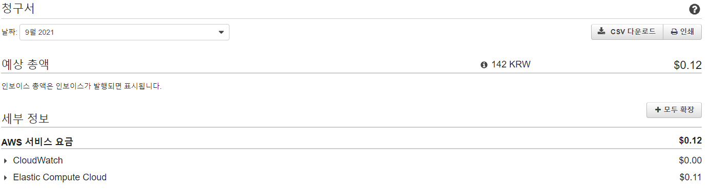
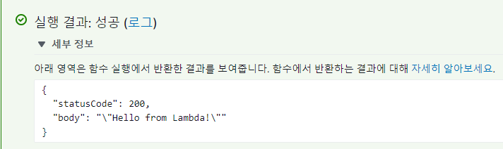

# 텔레그램 봇 프로젝트

## 계기

- 전에 일하던 곳에서 메신저 단톡방으로 텔레그램으로 긴 문장을 복붙하여 거기서 수정하는 작업을 하였었는데, 오타도 많고 매번 복사하느라 위로 올리고 긴 문장속에서 문자를 찾고 하는 작업이 상당히 까다로웠으며 게다가 하루에도 수백건씩 난무하는 단톡이 한개도 아니고 여러개 있었다.

- 코딩을 배우기 전에도 나름 개선하려는 노력이 많았었는데 매번 실패였었다. 하지만 이번에 코딩도 배웠고, 같은 작업을 여러번 복붙하는 작업을 가만둘 수 없어 기획하였다.

## 실행

- 우선 뭐가 필요할지 생각해보며 개데박(멋사스터디)인원들에게 물어봤다. AWS 서버, SQL, 텔레그램 봇 이정도는 필수라는 결과가 나왔다... 아 SQL😢.... 근데 불행중 다행인 것은 내가 최근에 AWS 공부를 조금씩 했다는 것이었다.😎

- 그래서 주말을 이용하여 살짝 알아보다가 괜찮은 [📌출처](https://github.com/jojoldu/aws-lambda-telegram-travisci)를 하나 알아냈다. 이것을 좀 따라가다보면 생각보다 쉽게 될 것 같았으나..

## AWS
- 이전 파이날 프로젝트때 프리티어 용량을 초과하여 aws 요금이 조금씩 오르는 중이었다 ㅠㅠ

- 그래도 나는 텔레그램 봇을 만들고 AWS Lambda와 API Gateway를 생성했다.

- 별달리 어려움은 없었지만 출처에서 나온 코드는 Node.js을 사용였는데 나는 파이썬 코드로하여 만들었다.<del>(어차피 바꾸려면 Node.js 알아야할텐데 그냥 할까 고민도 된다)</del>

---

- 일단 여기까지만 만들고 AWS 요금 체크를 하며 기다려보고, 차근차근 며칠에 한번씩 살살 진행해볼 예정이다. (11월쯤 사용테스트 예정)
