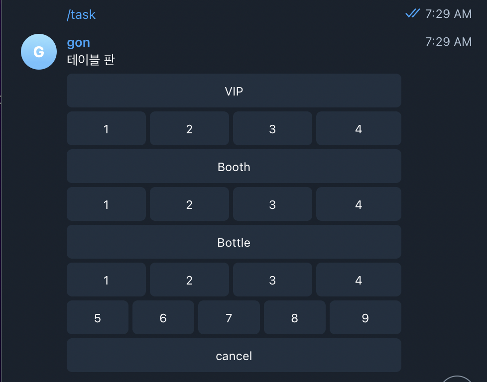
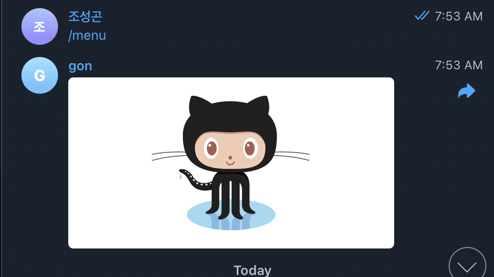
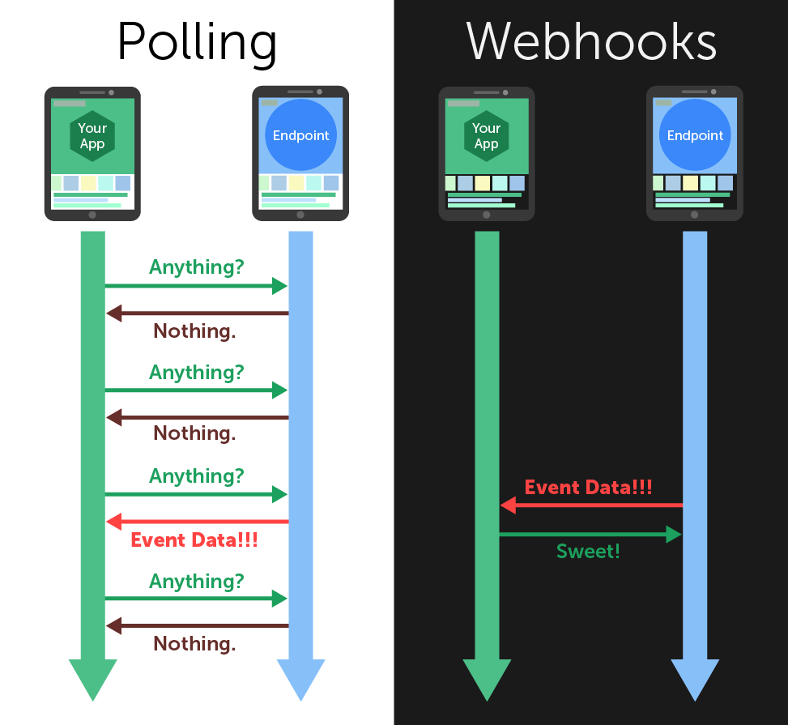

# 프로젝트 재시작
## 현재 진행
- 텔레그램 공식 라이브러리를 통해 텔레그램 봇의 버튼, 사진 전송 까지 구현을 하였다.
- 버튼 구현

- 사진 전송

## 네트워크 방식 변경의 필요성
- 현재 내가 짠 코드는 polling 방식으로 주기적으로 이벤트가 발생하였는지 확인하는 방식으로 EC2를 사용하여 구현을 하게 되면 데이터를 꽤나 먹을 것 같았다. 최대한 요금을 줄여야한다는 생각에 방식을 변경하기로 마음먹었다. 멋모르고 짰고, 네트워크에 대한 이해가 부족하여 오류를 범한 것 같다.

- polling 방식이 아닌 webhook방식을 활용하여 처음에 봤던 AWS Lambda, API gateway를 사용하여 구현하기로 마음 먹었다. webhook 방식은 polling 처럼 이벤트가 발생했는지 주기적으로 보내는 것이 아닌, 반대로 이벤트가 발생을 했을때만 그쪽에서 보내주는 방식이다.

- polling vs webhook
