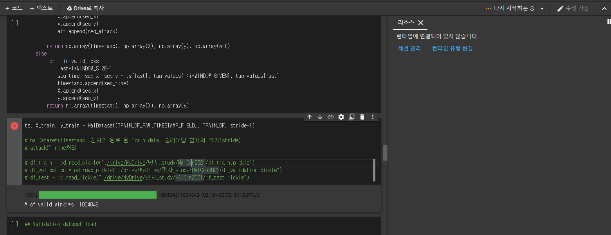

# 공모전 준비 2일차

## HAICon2021 산업제어시스템 보안위협 탐지 AI 경진대회

## 아침 회의

- 나는 RNN 기반의 모델들을 개념적인 부분에서 설명을 하였다. feed-forward neural network를 먼저 설명 하고 그 한계점 때문에 RNN이 나왔다. 라고 말하면서도 뭔가 설명하려니까 아닌가?  하는 생각이 들었다. 나는 안다고 생각했는데 막상 사람들 앞에서 설명을 하려니까 잘 되지않았던 것이다.

- 나름 인터넷에서 가족오락관 사진까지 가져와서 설명을 해보려 했지만 다들 머리를 갸우뚱하였고 뭔가 실패를 직감했다. 그리고 야코비안 행렬은 거의 이야기도 못하였고 LSTM까지 두루뭉실하게 이야기 했다.

## Colab 말썽

- Colab 런타임을 GPU 사용해도 내껀 다운되고 [범상](https://github.com/tkasod2)이껀 잘 돌아간다. (<del>구글이 나 싫어함?</del>) 하루종일 돌려도 되질 않고 진전이 되질않는다. 뭔가 의지가 되게 강했는데 이런 일에 일이 진척되지않아 갑자기 진이 쭉 빠졌다.

## 공부

- 이번주에 컴퓨팅적인 문제는 어쩔 수 없고 계속 돌려는 보되, 그동안 우리가 쓰는 모델(RNN기반의 LSTM,GRU,seq2seq)들에 대한 공부를 조금 더 열심히 해보기로 얘기가 나왔다. 이전에 멋사 강사님께서는 수학적인 부분보다는 이것저것 사용해보라고 하셨지만, 수학적인 부분을 알아야 성능이 조금 더 나올 것 같아 파보기로 하였다.

