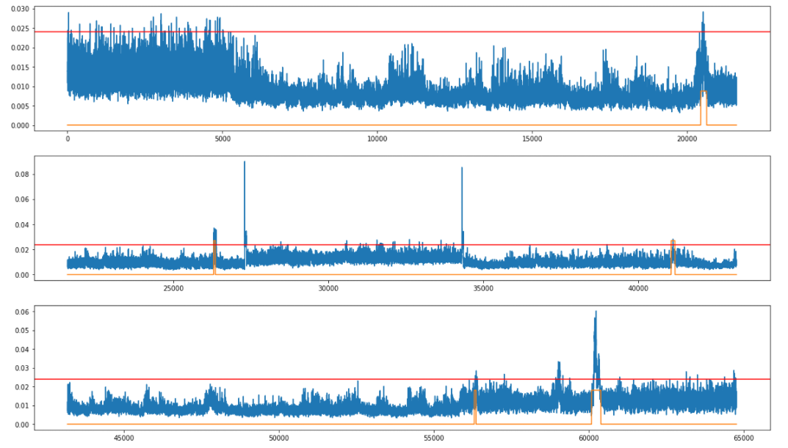

# 공모전 보류, 강의 기반 공부 시작

## 이유

- 공모전에서 수상작들에 대한 공부를 하였고, 1등 모델을 기반으로 한 [코드](https://github.com/jmsmg/HAI2021/blob/main/HAICon2021_09071630.ipynb)를 바탕으로 Window Size, Perceptron, Hidden Layer, Batch Size 수정하고, Epoch 숫자도 늘리며 작업을 진행하였지만 결과는 110명 정도에서 25등이 최고점이고, 점수는 좀처럼 오르지 않는 모습이었다. 

- 데이터 앞쪽에 찍혀있는 Noise부터 처리해야겠다고 판단하고, 우리는 ewm(지수평활)에 대한 공부를 하였고 그것은 우리가 전처리부터를 잘못했다는 것을 증명하였다.
- 그래서 우리는 곧바로 α값(지수평활계수)를 0.9 -> 0.98, 0.8로 바꾸어 진행을 해보았지만 점수는 크게 오르지않는 모습을 보였다.

## 강의 공부 시작

- 우리는 멋쟁이 사자처럼에서 배운 내용을 바탕으로 MachineLearning, DeepLearning에 대해 다시 강의를 보며 복습하기로 하였다. [소연](https://github.com/blackpearl-09)님과 [범상이](https://github.com/tkasod2)는 DeepLearning를 먼저 공부하고 싶다 하였고, 나는 MachineLearning을 공부하여 발표를 하기로 하였다. 그리고 평일에 일을 하시는 [혜민님](https://github.com/8maccaron8)은 [TheBatch](https://read.deeplearning.ai/the-batch/)에 대하여 하루에 내용 1개씩 발표해주시기로 하였다.

## 코드리뷰

- 더불어 코드리뷰도 하기로 하였는데 우리가 했던 이전 프로젝트들 또는 양질의 코드(예를 들면 수상작)를 리뷰하기로 하였고, 일정은 다음과 같다.

> 월 : 류범상 - 세미3 (2팀_아파트 단지 내 주차수요 예측 분석)  

> 화 : 이혜민 - 미드플젝 (1팀_부산 맛집 유사도 분석 (네이버지도 _ 블로그 리뷰 기반)  

> 수 : 정소연 -  미드플젝 (4팀_복지혜택 유사도에 따른 회사 추천 시스템)  

> 목 : 조성곤 - 데이콘플젝 (다른거 수상작)

---