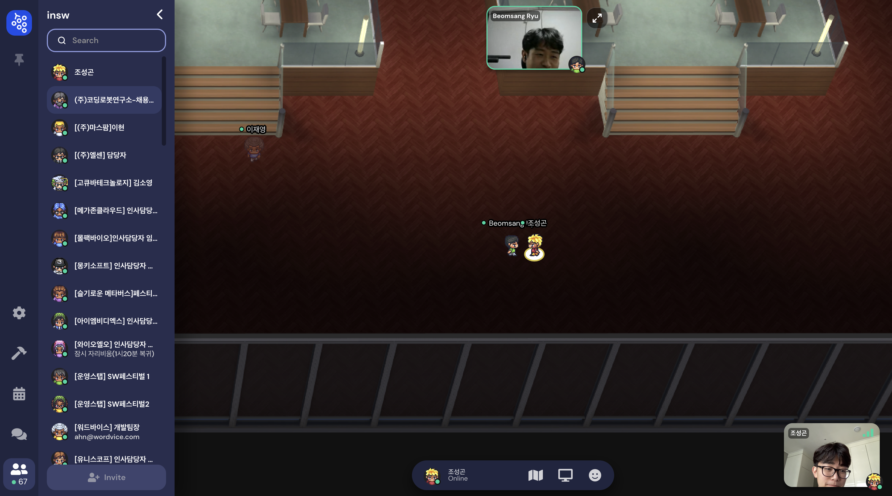
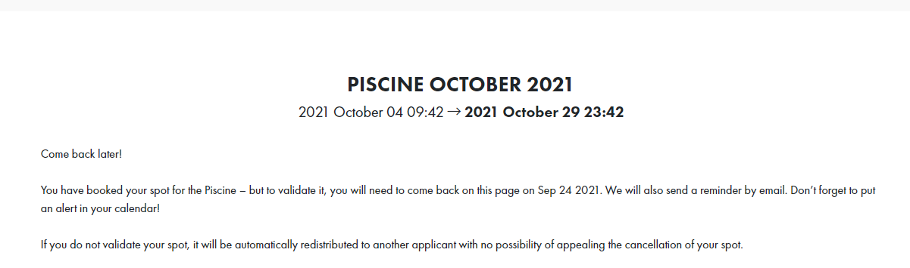

## gether 입문

- gether town에 입문했다.😎 (범상이와 인증샷)

- 바람의나라 느낌 나고 재밌고 마냥 웃기다ㅋㅋㅋ🤣 채용 설명회인데 너무 이 자체가 너무 재밌다.

---

## 깃허브 🐍snake 추가

- 게더타운으로 [용석님](https://github.com/flowermisty)을 만나 오랜만에 소식도 듣고, 깃허브에 snake를 추가하는 방법도 배웠다.

## 42서울 Piscine 예약 완료

- 42서울 예약을 완료했다. 파이널 프로젝트 AWS EC2로 배포 시도를 할때 리눅스 CLI 환경을 접했었는데 낯설지만 역시 코딩은 CLI 뽕이 최고였어서 배워보고 싶었는데 마침 뭐 지원금도 세전이지만 100만원이나 줘서 재밌을 것 같아보여 도전했다.

- 100만원가지고 서울에서 생활은 좀 어렵고 주말에 아르바이트라도 해야겠다. 라피신 기간에 실업급여가 되어서 다행이고 뭔가 어려운 길은 택한 것 같지만 재밌을 것 같다.

---

- 오늘 지식적으로 습득한건 많이 없는 것 같은데 인생 선택에 여러가지 갈림길이 있었던 것 같다. 채용설명회와 동시에 메타버스도 경험했고, 42서울 예약도 마쳤다. 취업이 우선이냐 하고싶은게 우선이냐에서 난 하고싶은걸 선택하였지만, 분명 현실적인 부분에서 이력서를 작성해보아야 겠다는 생각도 많이 들었으며, 아울러 취업이 목적이 아닌 나를 표현할 수단이 이력서든 블로그든 필요하다는 생각이 절실하게 들었던 하루였다.