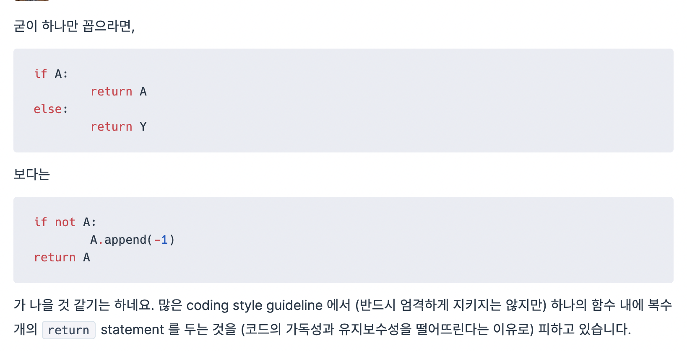
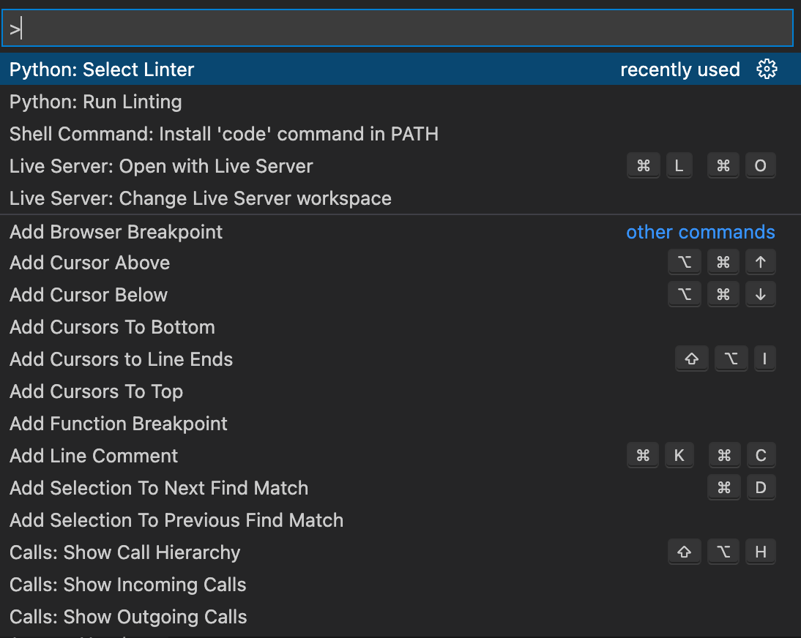

# python coding style guide pep8

## 계기

- 최근 알고리즘 공부를 하며 다른 사람 코드도 자주 보게 되어 코드리뷰를 받아보았는데 코드에 가독성이 떨어진다는 이야기를 들었다.

- 

- 문득 42서울에 있던 norminette라는 것이 생각났다. 맞춤법 교정 비슷한 것인데 이게 들여쓰기나 선언, 할당 할 때 정해진 규칙에 어긋나면 결과가 맞아도 얄짤없이 틀리게 처리해버리는 나름 스트레스 받는 룰이었다. 이게 지금 생각해보니 코딩스타일 중에 하나였던 것이라는걸 깨닫게 되었다.

## pep8

- 파이썬에는 [pep8](https://www.python.org/dev/peps/pep-0008/)이라는 코딩스타일 있다. 일관성 있는 스타일로 습관을 들여놔야 코드 설명도 편하고, 다른 사람들도 보기 편할 것 같아서 한번 익혀보려고 마음을 먹었다.

- [관련 링크](https://wayhome25.github.io/python/2017/05/04/pep8/)를 찾아서 따라해보려 했으나 선비처럼 공부하는 것보다 습관을 들이는게 편하겠다 생각하여 norminette 같은 프로그램을 찾아보았다.

## VSCODE lint

- lint라는 것을 찾았는데, 문법 오류가 아니라 스타일적인 부분을 잡아주어 사용하게 되었다.

1. pep8을 아래에 명령어를 터미널 창에 입력하여 설치한다.

    ``` shell
    pip install pep8
    ```
    - 간혹 pip(설치 프로그램) 업데이트가 되지 않았으면 pip install --upgrade pip 명령어로 업그레이드를 진행하고 설치해주어야한다.

2. VSCODE를 켜고 F1 또는 ctrl + shift + p를 눌러 command palette를 연다.


3. command palette 창을 열고 python:select Linter 설정 -> flask8 선택

- 완료!