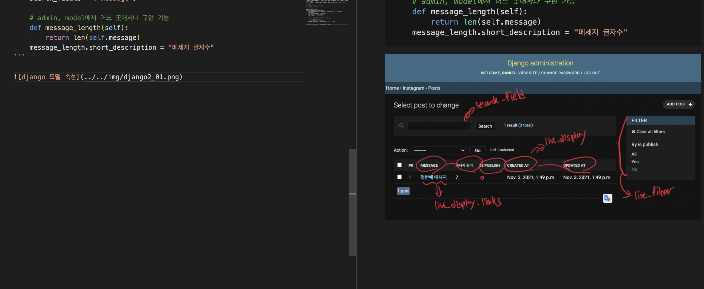
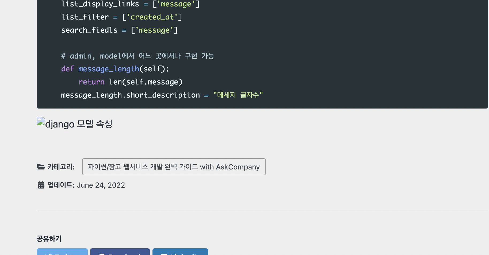
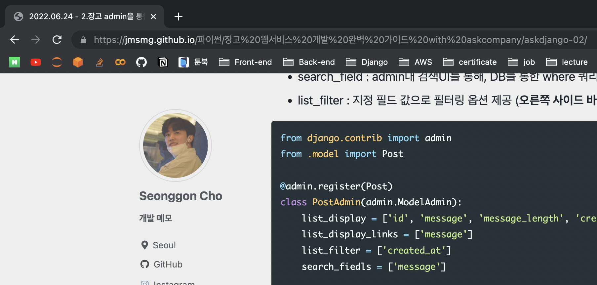
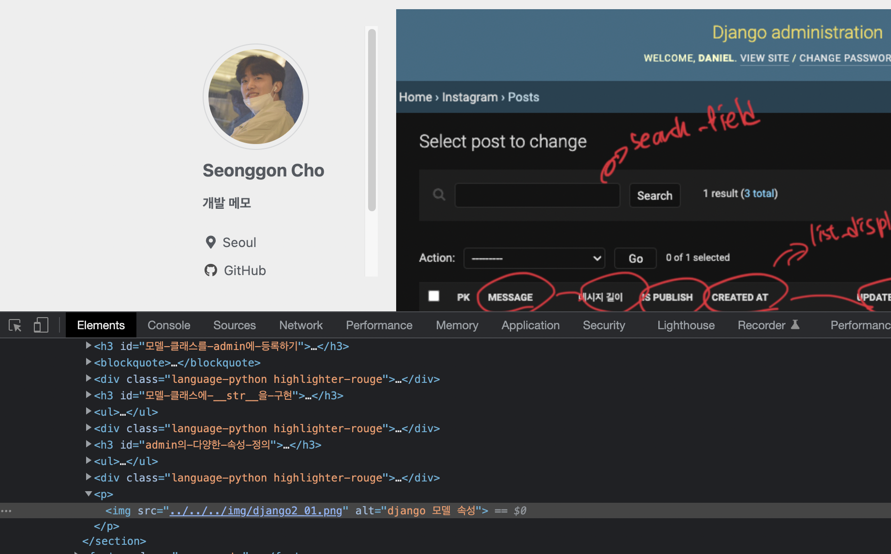

## jekyll에서 image 안올라가는 문제 발생

- 깃허브 io에서 이미지가 안올라가는 문제가 발생하였다.

- 아래와 같이 vsc에서는 잘 작동하나, 블로그 상에선 나오지 않는 모습이다

---

- 파일이 잘못된건지, 용량이 너무 큰 건 아닌지, 사이즈도 상관이 있는지, 깃허브 자체 오류인지 한참을 헤매다가 특정 카테고리에서만 되지 않는다는 사실을 깨닫고 url부분을 확인하였다.

- url부분을 확인하니 카테고리명에서 파이썬/장고라는 부분에서 슬래시(/)가 포함되어 url상에서 상위 폴더로 인식이 되다보니 인식 되지 않는다는 사실을 알았다.

- 개발자 모드에서 상위 폴더를 뜻하는 '../' 문구를 추가해주고 확인해보니 잘나타나는 모습을 확인하였다.

- 해당 카테고리 이미지에만 ../ 문구를 추가해주니 정상 작동 하였다.